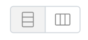
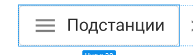

- очень много серых цветов, вместо некоторых новых использовал уже имеющиеся
- все кнопки можно собрать в два вида и одну модификацию для группы       , но они слишком разные на макете, пока просто упростил немного 
- иконки разного размера в типовых кнопках, не стал подгонять  . Вижу что там сделано чтобы была равная высота кнопок действий и переключения вида, но это разные компоненты, связал через жесткую высоту их
- изменение размера половинок можно сделать без скрипта, просто стилем resize, тогда бы не было красивой хваталки, но если можно не писать скрипт лучше не писать скрипт) 